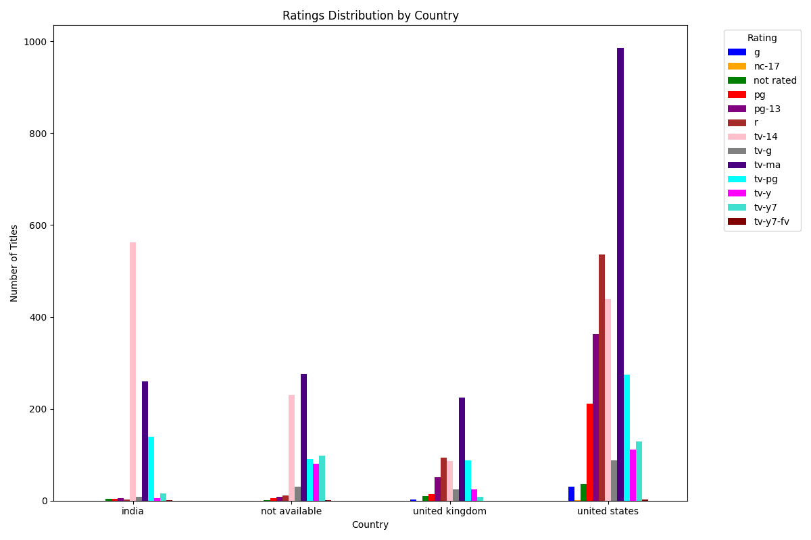
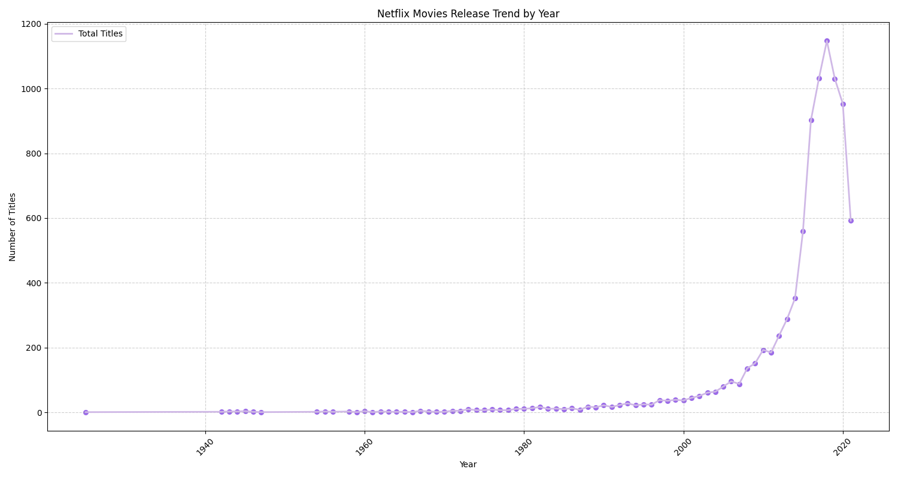

# CleanFlix

CleanFlix is a project where Netflix data was obtained through the **Kaggle**, and thorough cleaning of the dataset was performed. For the cleaning task, duplicate entries were checked and missing values were addressed by filling or flagging, correcting the data entries, and standardizing the format. The datasets were analyzed via various plots presented with legends for enhancing the understanding. The project was built using Python libraries such as Pandas, NumPy, and Matplotlib for data processing and visualization, and Flask along with HTML and Bootstrap for interactive presentation.

## Table of Contents

- [CleanFlix](#cleanFlix)
  - [Table of Contents](#table-of-contents)
  - [Installation](#installation)
  - [Project Plot Screenshots](#project-plot-screenshots)
  - [File structure](#file-structure)

## Installation


1. Clone the repository and navigate to the project directory:

   ```shell
   git clone https://github.com/sabnam-subedi/CleanFlix.git
   ```

   ```shell
   cd CleanFlix
   ```

2. Create and activate a virtual environment:
   ```shell
   python3 -m venv venv
   ```
   ```shell
   source venv/Scripts/activate
   ```
3. Install the required python packages:

   ```shell
   pip install -r requirements.txt
   ```

4. Set the Flask App:
   ```shell
   export FLASK_APP=app
   ```
5. [Optional] To run the web app in development mode:
   ```shell
   export FLASK_ENV=development
   ```
6. [Optional] To run the web app in debug mode:
   ```shell
   export FLASK_DEBUG=true
   ```
7. Finally run the web app:
   ```shell
   flask run
   ```


## Project Plot Screenshots


<!-- *Line Graph* -->

_Line Graph:_ Average Movie Duration Over Time

<br />


<!-- *Pie Chart* -->

_Pie Chart:_ Origin of Movies & TV Shows by Country

<br />



<!-- *Multiple Bar Graph* -->

_Multiple Bar Graph:_ Ratings Distribution by Top Countries

<br />



<!-- *Caption: Line Graph* -->

_Line Graph:_ Netflix Release Trend Over the Years

<br />


<!-- *Caption: Bar Graph* -->

_Bar Graph:_ Distribution of Movies and TV Shows
<br />

## File structure

```
CleanFlix/
├── static/
│   ├── data/
│   │   ├── cleaned/
│   │   │   └── netflix_cleaned.xlsx
│   │   └── raw/
│   │       └── netflix_titles.csv
│   ├── plots/
│   │   ├── avg_movie_duration.png
│   │   ├── country_pie_chart.png
│   │   ├── rating_by_country.png
│   │   ├── release_trend.png
│   │   └── type_bar.png
│   └── styles/
│       └── style.css
├── templates/
│   ├── base.html
│   ├── data.html
│   ├── index.html
│   ├── plots.html
│   └── raw.html
├── venv/
├── .gitignore
├── app.py
├── netflix_cleaning.py
├── README.md
└── requirements.txt

```
